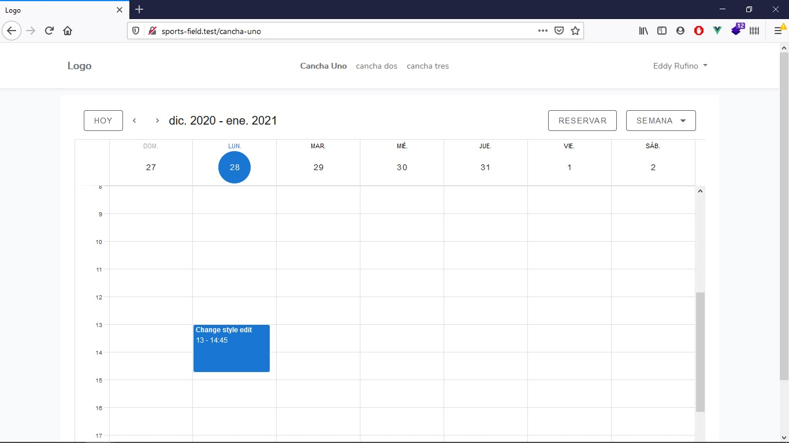

# Reservar canchas deportivas

## Sobre el proyecto

Sistema para hacer reservas de canchas deportivas

# Guía para instalar el proyecto
Este es un proyecto de prueba realizado en el curso **Desarrollo de un blog con manejo de roles y permisos**

1. Descarga el repositorio
2. Descromprime la carpeta dentro del directorio de Valet/Laragon
3. Renombra la carpeta (Opcional) 
4. Entra a la carpeta desde la terminal `cd directorio/de/la/carpeta`
5. Copia el contenido del archivo `.env.example` a un nuevo archivo llamado `.env`
    * Si estás en Liunx o Mac puedes ejecutar el comando: `cp .env.example .env`
6. Crea una base de datos para el proyecto
7. Modifica las variables de conexión del nuevo archivo `.env` 
    * Define los datos de conexión 
        * DB_DATABASE=
        * DB_USERNAME=
        * DB_PASSWORD=
    * Define las credenciales de [Mailtrap](https://mailtrap.io/) (Opcional)
8. Ejecuta `composer install`
9. Ejecuta `php artisan key:generate`
10. Ejecuta `php artisan migrate`
11. Ejecuta `php artisan db:seed`
13. Abre la aplicación en el navegador
14. Accede a `/login` para ingresar a la administración
    * Email: eddyjaair@gmail.com
    * Password: password

#### Todos los proyectos creados en los cursos de Aprendible están bajo la [licencia MIT](https://opensource.org/licenses/MIT).
